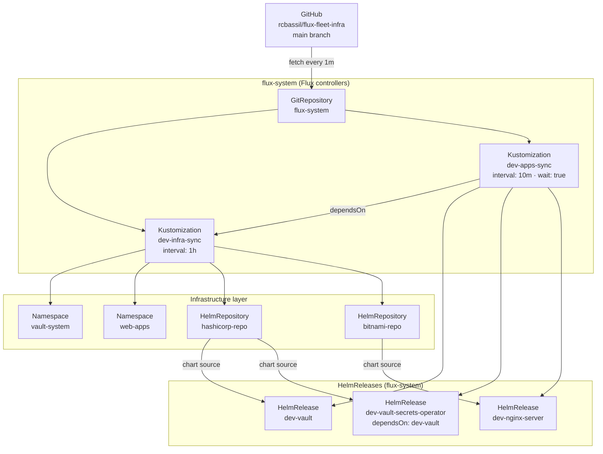
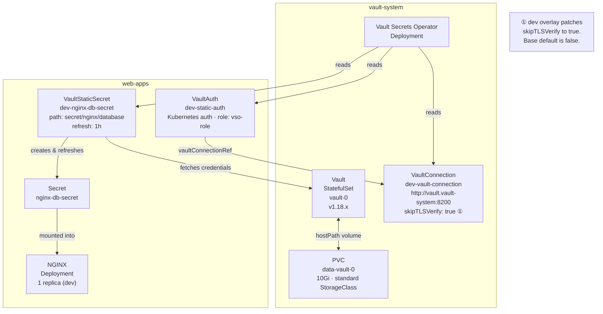
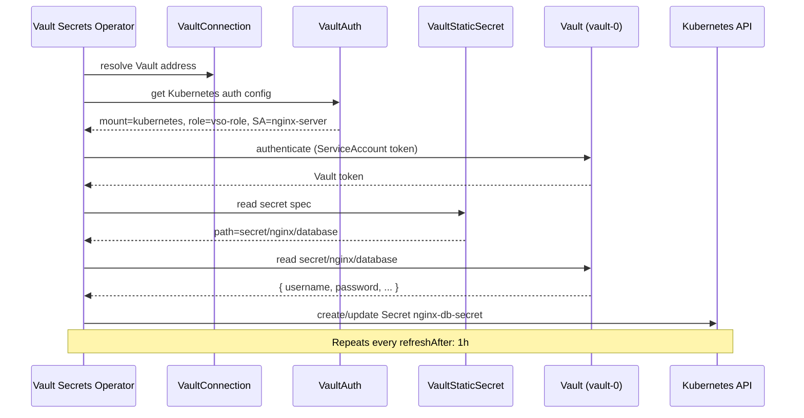
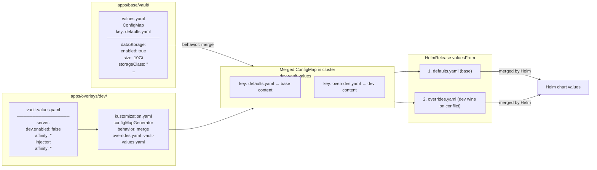

# Architecture

## 1. GitOps Sync Flow

How Flux pulls from Git and reconciles the cluster.



---

## 2. In-Cluster Resources

What gets deployed into each namespace.



---

## 3. Vault Secret Injection

How a Kubernetes Secret gets created from a Vault path.



---

## 4. Base/Overlay Values Pattern

How Helm values are layered across environments.



---

## 5. Repository Layout

```
flux-fleet-infra/
├── clusters/
│   └── my-local-cluster/
│       ├── flux-system/          ← Flux bootstrap (generated, do not edit)
│       └── dev/
│           ├── infra.yaml        ← Kustomization → apps/infrastructure/dev
│           └── apps.yaml         ← Kustomization → apps/overlays/dev
│
└── apps/
    ├── infrastructure/
    │   └── dev/
    │       ├── namespaces/       ← vault-system, web-apps
    │       └── sources/          ← HelmRepository (hashicorp, bitnami)
    │
    ├── base/
    │   ├── vault/                ← HelmRelease + defaults ConfigMap
    │   ├── vault-operator/       ← HelmRelease + defaults ConfigMap + VaultConnection + RBAC
    │   └── nginx/                ← HelmRelease + defaults ConfigMap + VaultAuth + VaultStaticSecret
    │
    └── overlays/
        └── dev/
            ├── kustomization.yaml          ← namePrefix: dev-, configMapGenerator, patches
            ├── vault-values.yaml           ← dev overrides (affinity, dev mode)
            ├── vault-operator-values.yaml  ← dev overrides (Vault address)
            └── nginx-values.yaml           ← dev overrides (1 replica)
```
