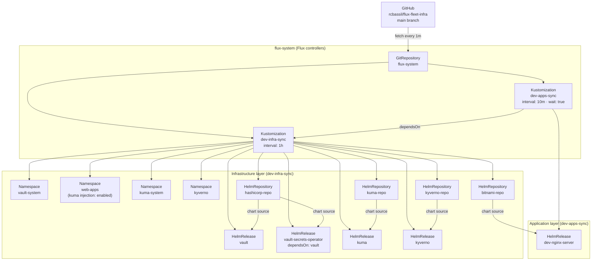
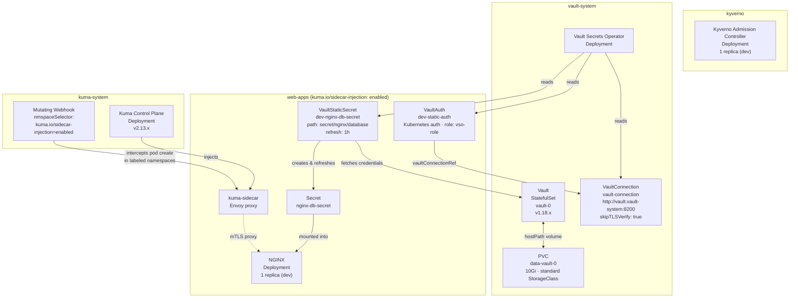
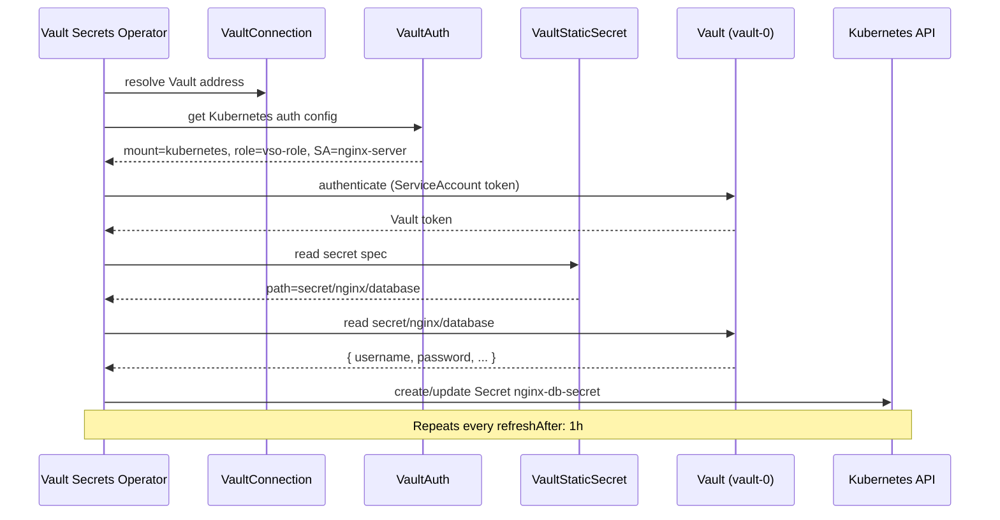
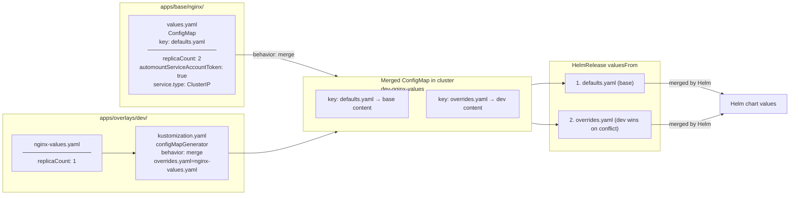

# Architecture

## 1. GitOps Sync Flow

How Flux pulls from Git and reconciles the cluster.



---

## 2. In-Cluster Resources

What gets deployed into each namespace.



---

## 3. Vault Secret Injection

How a Kubernetes Secret gets created from a Vault path.



---

## 4. Base/Overlay Values Pattern (Applications)

How Helm values are layered across environments for application workloads.



Infrastructure controllers (Vault, Kuma, Kyverno) use inline `values:` in their HelmRelease instead of this pattern — no ConfigMap indirection needed since they are single-environment.

---

## 5. Repository Layout

```
flux-fleet-infra/
├── clusters/
│   └── my-local-cluster/
│       ├── flux-system/          ← Flux bootstrap (generated, do not edit)
│       └── dev/
│           ├── infra.yaml        ← Kustomization → apps/infrastructure/dev (1h)
│           └── apps.yaml         ← Kustomization → apps/overlays/dev (10m, dependsOn infra)
│
└── apps/
    ├── infrastructure/
    │   └── dev/
    │       ├── sources/          ← HelmRepository (hashicorp, bitnami, kuma, kyverno)
    │       ├── namespaces/       ← vault-system, web-apps, kuma-system, kyverno
    │       └── controllers/      ← HelmReleases with inline values
    │           ├── vault.yaml
    │           ├── vault-operator.yaml
    │           ├── vault-connection.yaml
    │           ├── vault-rbac.yaml
    │           ├── kuma.yaml
    │           └── kyverno.yaml
    │
    ├── base/
    │   └── nginx/                ← HelmRelease + defaults ConfigMap + VaultAuth + VaultStaticSecret
    │
    └── overlays/
        └── dev/
            ├── kustomization.yaml   ← namePrefix: dev-, configMapGenerator, patches
            └── nginx-values.yaml    ← dev overrides (1 replica)
```
