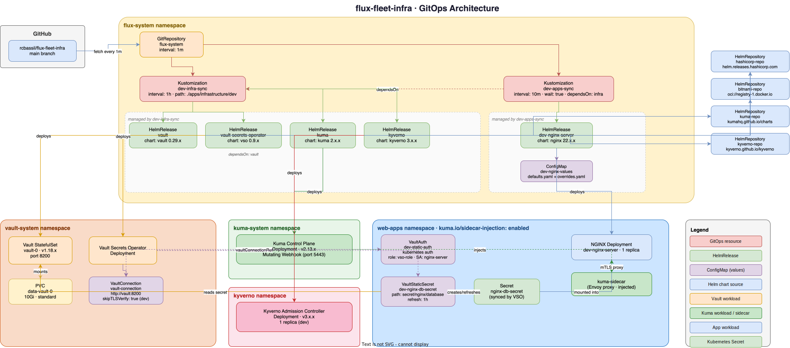

# flux-fleet-infra

GitOps repository for managing Kubernetes infrastructure and applications using [FluxCD](https://fluxcd.io/). Infrastructure controllers (service mesh, policy engine, secrets management) are deployed as direct HelmReleases in the infrastructure layer. Applications use a base/overlay pattern for environment-specific configuration.

## Architecture



> Full interactive diagram: [docs/architecture.drawio](docs/architecture.drawio)

## Repository Structure

```
.
├── clusters/
│   └── my-local-cluster/         # minikube local cluster
│       ├── flux-system/          # Flux bootstrap manifests (generated)
│       └── dev/
│           ├── infra.yaml        # Syncs apps/infrastructure/dev (1h interval)
│           └── apps.yaml         # Syncs apps/overlays/dev (10m interval), depends on infra
└── apps/
    ├── base/                     # Environment-agnostic Helm release definitions
    │   └── nginx/
    ├── infrastructure/
    │   └── dev/                  # Infrastructure sources, namespaces, and controllers
    │       ├── sources/          # HelmRepository resources
    │       ├── namespaces/       # Namespace resources
    │       └── controllers/      # Infrastructure HelmReleases (Vault, Kuma, Kyverno)
    └── overlays/
        └── dev/                  # Dev-specific patches and values (apps only)
```

## Infrastructure Controllers

Deployed by `dev-infra-sync` at a 1h interval. Values are inlined directly in each HelmRelease.

| Controller | Chart | Namespace | Version |
|---|---|---|---|
| [Vault](apps/infrastructure/dev/controllers/vault.yaml) | hashicorp/vault | vault-system | 0.29.x |
| [Vault Secrets Operator](apps/infrastructure/dev/controllers/vault-operator.yaml) | hashicorp/vault-secrets-operator | vault-system | 0.9.x |
| [Kuma](apps/infrastructure/dev/controllers/kuma.yaml) | kumahq/kuma | kuma-system | 2.x.x |
| [Kyverno](apps/infrastructure/dev/controllers/kyverno.yaml) | kyverno/kyverno | kyverno | 3.x.x |

## Applications

Deployed by `dev-apps-sync` at a 10m interval, after infrastructure is ready.

| App | Chart | Namespace | Version |
|---|---|---|---|
| [NGINX](apps/base/nginx/) | bitnami/nginx | web-apps | 22.x.x |

## How It Works

### Infrastructure vs Application Layer

**Infrastructure controllers** (Vault, Kuma, Kyverno) live under `apps/infrastructure/dev/controllers/`. They are single-environment platform services with inline Helm values — no base/overlay indirection. They are reconciled at a 1h interval by `dev-infra-sync`.

**Applications** (NGINX) live under `apps/base/` with environment-specific overlays in `apps/overlays/<env>/`. This pattern supports multi-environment deployments with different values per environment. They are reconciled at a 10m interval by `dev-apps-sync`, which depends on `dev-infra-sync` being healthy first.

### Base/Overlay Pattern (Applications)

Each app in `apps/base/` defines a `HelmRelease` and a `ConfigMap` with a `defaults.yaml` key. Environment overlays in `apps/overlays/<env>/` use `configMapGenerator` with `behavior: merge` to add an `overrides.yaml` key on top.

Each `HelmRelease` reads both keys in order via two `valuesFrom` entries:

```yaml
valuesFrom:
  - kind: ConfigMap
    name: app-values
    valuesKey: defaults.yaml   # base defaults, always present
  - kind: ConfigMap
    name: app-values
    valuesKey: overrides.yaml  # env-specific overrides, optional
    optional: true
```

### Kuma Service Mesh

The `web-apps` namespace has the `kuma.io/sidecar-injection: enabled` **label** (not annotation — the Kuma mutating webhook `namespaceSelector` matches labels). Any pod created in that namespace automatically gets the `kuma-sidecar` container injected.

For sidecar injection to work, pods must have `automountServiceAccountToken: true` so the sidecar can authenticate with the Kuma control plane using the Kubernetes ServiceAccount token.

### Vault Integration

NGINX pulls database credentials from Vault using the Vault Secrets Operator:

```
VaultConnection (vault-system, skipTLSVerify: true in dev)
    └── VaultAuth (per namespace, Kubernetes auth method)
            └── VaultStaticSecret (per app, synced every 1h)
                    └── Kubernetes Secret (consumed by the pod)
```

`VaultConnection`, `VaultAuth`, and RBAC are defined in [apps/infrastructure/dev/controllers/](apps/infrastructure/dev/controllers/) and [apps/base/nginx/](apps/base/nginx/).

### Persistent Storage (Vault)

Vault data is stored on a 10Gi `PersistentVolumeClaim` using the `standard` StorageClass (minikube's hostPath provisioner). Data lands inside the minikube VM at `/tmp/hostpath-provisioner/vault-system/`.

After any Vault pod restart, Vault comes back sealed and must be manually unsealed:

```sh
kubectl exec -n vault-system vault-0 -- vault operator unseal <key>
# repeat with 3 of your 5 unseal keys
```

## Prerequisites

- [minikube](https://minikube.sigs.k8s.io/)
- [flux CLI](https://fluxcd.io/flux/installation/)
- A GitHub personal access token with repo access

## Bootstrap

```sh
minikube start

flux bootstrap github \
  --owner=<your-github-username> \
  --repository=flux-fleet-infra \
  --branch=main \
  --path=clusters/<your-cluster-name> \
  --personal
```

Once bootstrapped, Flux will reconcile all infrastructure and applications automatically.

## Adding a New Infrastructure Controller

1. Add a `HelmRepository` under `apps/infrastructure/dev/sources/` if the chart source is new.
2. Add a `Namespace` under `apps/infrastructure/dev/namespaces/`.
3. Create `apps/infrastructure/dev/controllers/<name>.yaml` with a `HelmRelease` using inline `values:`.
4. Wire all three into `apps/infrastructure/dev/kustomization.yaml`.

## Adding a New Application

1. Create `apps/base/<app>/` with:
   - `release.yaml` — HelmRelease with two `valuesFrom` entries (`defaults.yaml` and `overrides.yaml`)
   - `values.yaml` — ConfigMap with a `defaults.yaml` key containing base Helm values
   - `kustomization.yaml` — listing both files as resources
2. Add `apps/overlays/dev/<app>-values.yaml` with dev-specific overrides, and wire it into the overlay `kustomization.yaml` using `behavior: merge`.
3. Add patches to `apps/overlays/dev/kustomization.yaml` to update both `valuesFrom[0].name` and `valuesFrom[1].name` to the `dev-`-prefixed ConfigMap name.
4. If the app needs a new Helm source, add a `HelmRepository` under `apps/infrastructure/dev/sources/`.
